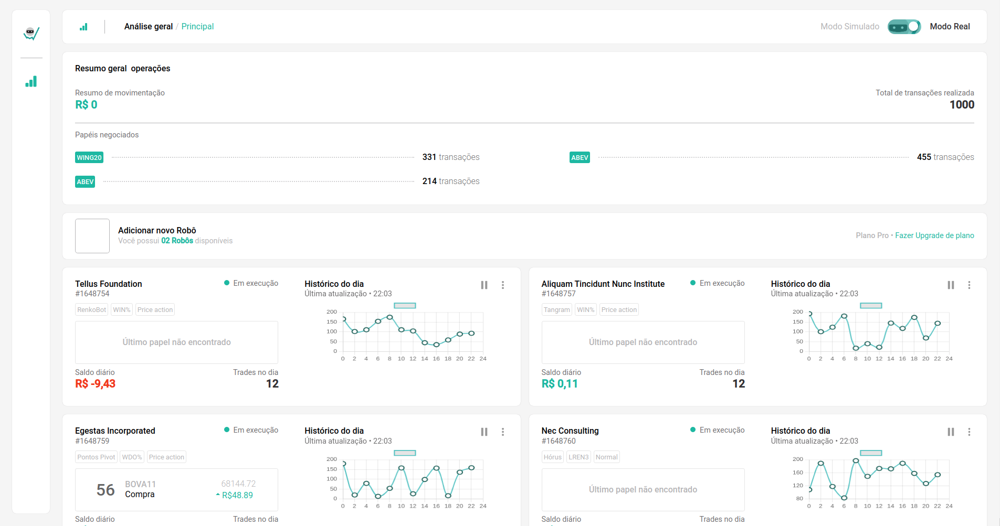
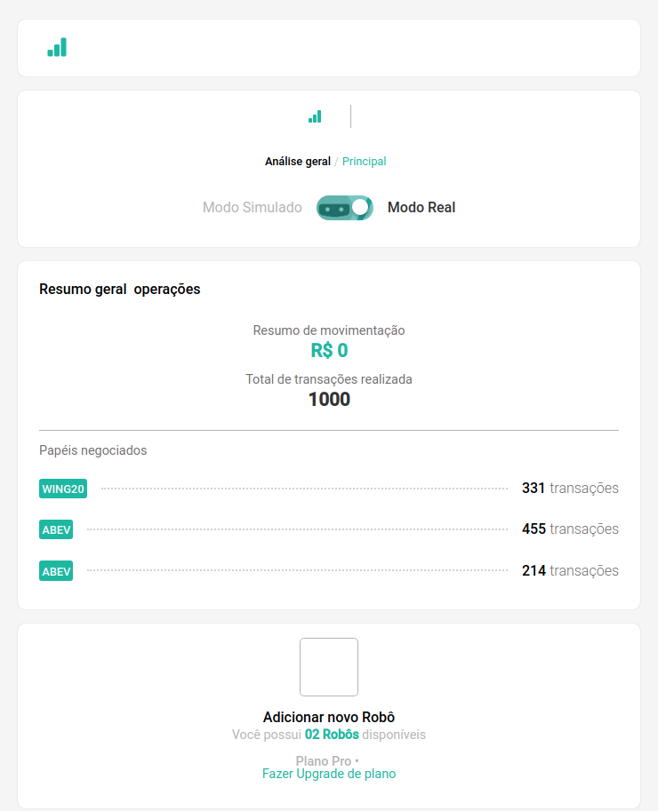
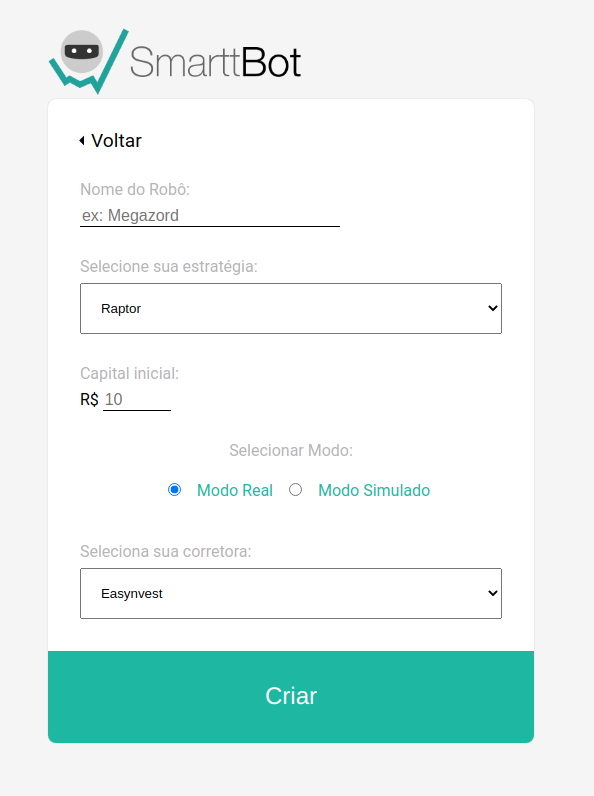

<p align="center">In this project, 
I challenged myself putting in practice very important concepts from React and stylization, like Grid, integration with API, versioning, componentization, organization, 
form validation, routes navigation, documentation and so much more...

I am very proud to had the opportunity, it was a huge learning experience from start to finish :)

</p>

<div align="center">
  <sub> Made with 💖 by
    <a href="https://github.com/ankle-code">Lucas Passeli
  </sub>
</div>

# 📌 Contents

- [Screenshots](#camera-screenshot)
- [Technologies](#rocket-technologies)
- [How to Run](#computer-how-to-run)
- [Issues](#bug-issues)

# :camera: Screenshots

<div align="center">
   
   
   
</div>

<p align="center">You can also see the application over here in <a href="https://smarttbot-challenge.vercel.app/">Vercel</a>

</p>

# :rocket: Technologies

This project was made using the follow technologies:

- [React](https://reactjs.org/)
- [Redux](https://redux.js.org/)
- [Redux-Thunk](https://github.com/reduxjs/redux-thunk)
- [Styled-Components](https://styled-components.com/)
- [Axios](https://github.com/axios/axios)
- [React-Router-Doom](https://www.npmjs.com/package/react-router-dom)
- [Yup](https://www.npmjs.com/package/yup)
- [React Icons](https://react-icons.github.io/react-icons/)
- [React-Hook-Form](https://react-hook-form.com/)
- [ChartJs](https://www.chartjs.org/)
- [React-Chartjs-2](https://www.npmjs.com/package/react-chartjs-2)
- [Date-Fns](https://date-fns.org/)
- [@hookForm](https://www.npmjs.com/package/@hookform/resolvers)

# :computer: How to run

```bash
# Clone Repository
$ git clone git@github.com:ankle-code/smarttbot-challenge.git && cd smarttbot-challenge

# Install Dependencies
$ yarn

# Fill .env.local file with YOUR environment variables, according to .env.example file.

# Run Aplication
$ yarn start
```

Go to http://localhost:3000/ to see the application running.

# :bug: Issues

Create a <a href="https://github.com/ankle-code/smarttbot-challenge/issues">new issue report</a>, it will be an honor to be able to help you solve and further improve our application.

Made with 💖 by [Lucas Passeli](https://www.linkedin.com/in/lucas-passeli/).
